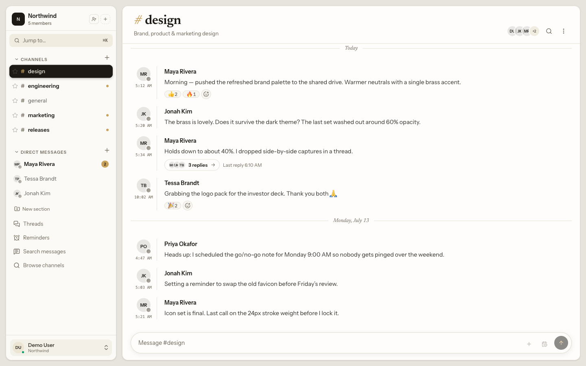

<p align="center">
  <picture>
    <source media="(prefers-color-scheme: dark)" srcset=".github/readme-banner-dark.png">
    
  </picture>
</p>

<p align="center">
  A calm, fast, <strong>self-hosted team chat</strong> app you run yourself —
  workspaces, channels, threads, reactions, search, reminders, and scheduled
  messages. Built with Laravel 13, Inertia + Vue 3, Laravel Reverb (WebSockets),
  and Meilisearch.
</p>

<p align="center">
  <a href="https://github.com/emmpaul/the-desk/actions/workflows/tests.yml"></a>
  <a href="https://github.com/emmpaul/the-desk/releases"></a>
  <a href="LICENSE"></a>
</p>

<p align="center">
  <a href="https://the-desk.emmanuelpaul.com">Website</a> ·
  <a href="https://the-desk.emmanuelpaul.com/docs/">Docs</a> ·
  <a href="https://the-desk.emmanuelpaul.com/docs/self-hosting/installation/">Install</a> ·
  <a href="https://the-desk.emmanuelpaul.com/docs/comparison/">vs&nbsp;Slack</a> ·
  <a href="LICENSE">MIT&nbsp;License</a>
</p>

<p align="center">
  
</p>

## Self-hosting

The Desk ships as a single Docker Compose stack with a prebuilt image — one
`docker compose up -d` and it's live. Full operator docs (requirements,
install, reverse proxy & TLS, upgrades) live at
**[the-desk.emmanuelpaul.com/docs](https://the-desk.emmanuelpaul.com/docs/)**.

## Development

Local development uses [Laravel Sail](https://laravel.com/docs/sail):

```bash
git clone https://github.com/emmpaul/the-desk.git
cd the-desk
cp .env.example .env
composer install
./vendor/bin/sail up -d
./vendor/bin/sail composer setup
```

Run the quality gate before pushing:

```bash
./vendor/bin/sail composer test        # Pint, PHPStan, Rector (dry-run), and tests at 100% coverage
./vendor/bin/sail npm run lint:check    # ESLint / Prettier / vue-tsc / build
```

[Rector](https://github.com/rectorphp/rector) handles automated structural
refactoring (the semantic counterpart to Pint's formatter). The gate runs it in
dry-run mode; when it reports pending changes, apply them and re-run the gate:

```bash
./vendor/bin/sail composer refactor    # apply Rector's suggested refactors
```

### Browser (E2E) realtime tests

`tests/Browser` holds Pest 4 browser tests that drive real Playwright browsers
against the app served in-process, with two clients exchanging messages over a
live Reverb server — the realtime send/receive, typing, edit, and delete paths
that headless feature tests can't reach. They live in a separate `browser` test
group excluded from the coverage gate, so `composer test` never runs them (and
they never affect the 100% coverage requirement). CI runs them in a dedicated
`browser` job.

Prerequisites (one-time, inside the Sail container):

```bash
./vendor/bin/sail npm ci                              # playwright npm package
./vendor/bin/sail npx playwright install chromium     # the browser binary
```

Then, with Sail up (Reverb is part of `sail up -d`) and the frontend built:

```bash
./vendor/bin/sail npm run build                       # tests use the built assets
./vendor/bin/sail composer test:browser               # or: sail bin pest tests/Browser
```

Rebuild the frontend (`npm run build`) after changing any Vue component the
tests touch, since the in-process server serves the compiled Vite assets.

### Local SSO providers (OIDC & LDAP)

Two opt-in dev containers let you exercise the single sign-on flows against real
providers locally, without registering an app at an external IdP. They sit
behind the `sso` compose profile, so a plain `sail up` never starts them. Enable
them by setting `COMPOSE_PROFILES=sso` in your `.env` (or `sail up --profile
sso`), then uncomment the matching dev values in `.env.example`:

- **OIDC** — a mock provider ([soluto/oidc-server-mock](https://github.com/Soluto/oidc-server-mock))
  seeded with `oidc1@the-desk.local` … `oidc4@the-desk.local` (password
  `password`) and a pre-registered `the-desk-dev` client. It's reached as
  `oidc:8081` from both the browser and the app container so the derived issuer
  stays consistent, so add one line to your host's `/etc/hosts` once:

  ```
  127.0.0.1 oidc
  ```

  Then set `SSO_OIDC_ISSUER=http://oidc:8081`, `SSO_OIDC_CLIENT_ID=the-desk-dev`,
  `SSO_OIDC_CLIENT_SECRET=the-desk-dev-secret` and use "Sign in with SSO".

- **LDAP** — an OpenLDAP directory ([osixia/openldap](https://github.com/osixia/docker-openldap))
  seeded with `ldap1@the-desk.local` … `ldap4@the-desk.local` (password
  `password`) under `dc=the-desk,dc=local`. Uncomment the dev block in
  `.env.example`:

  ```
  LDAP_HOST=ldap
  LDAP_PORT=389
  LDAP_BASE_DN="dc=the-desk,dc=local"
  LDAP_USERNAME="cn=admin,dc=the-desk,dc=local"
  LDAP_PASSWORD=adminpassword
  LDAP_ATTR_GUID=entryuuid   # OpenLDAP's stable id, not AD's objectGUID
  ```

  Then sign in through the normal login form with a seeded email.

## Self-Hosting with Docker

The production stack is orchestrated with `docker-compose.prod.yml`. The app is
served with [FrankenPHP](https://frankenphp.dev/); Postgres, Meilisearch, Reverb,
a queue worker, and the scheduler all run as containers.

By default the stack **pulls a prebuilt image** from the GitHub Container Registry
(`ghcr.io/emmpaul/the-desk`), so `up -d` runs it with no build step. Every setting,
including the browser-facing Reverb values, is read at **runtime**, so one
published image works for any host. If you would rather **build from source**, a
one-line overlay restores a local build — see
[Building from source](#building-from-source).

### Prerequisites

- Docker Engine 24+ and the Docker Compose plugin.
- A domain and a TLS-terminating reverse proxy (nginx, Caddy, Traefik, …) in
  front of the stack. **TLS/HTTPS is your responsibility** — the containers speak
  plain HTTP. Your proxy must also forward WebSocket upgrade requests to the
  `reverb` service.

### First install

```bash
# 1. Clone and check out the latest release tag.
git clone https://github.com/emmpaul/the-desk.git
cd the-desk
git fetch --tags
git checkout v1.5.2 # x-release-please-version         (the desired release tag)

# 2. Generate .env with all required secrets filled in.
#    Creates .env from the template and fills APP_KEY, DB_PASSWORD,
#    MEILISEARCH_KEY, and the REVERB_* keys with fresh random values.
#    Safe to re-run — it never overwrites values you have already set.
./docker/gen-secrets.sh

# 3. Edit .env and set the non-secret settings the script can't guess:
#    APP_URL, SMTP mail credentials, and — since your TLS proxy terminates
#    wss/443 while the container speaks http/8080 — REVERB_PORT_PUBLIC=443 and
#    REVERB_SCHEME_PUBLIC=https. These are read at runtime (a restart applies
#    changes), so no rebuild is needed when they change.

# 4. Start the stack. This pulls the release-pinned image — no build step.
docker compose up -d
```

> **Why no `-f docker-compose.prod.yml`?** `.env.prod.example` ships
> `COMPOSE_FILE=docker-compose.prod.yml`, which the `docker compose` CLI reads
> from `.env`, so every production subcommand (`up`, `ps`, `logs`, `exec`,
> `down`) resolves the production stack with no flag. It matters here: this repo
> also contains `compose.yaml`, the Sail **dev** stack, which a bare
> `docker compose` would otherwise pick up. The flip side is that a bare
> `docker compose down` in this directory takes down production, with no `-f` to
> remind you what you are aimed at. An explicit `-f` still overrides it, so an
> instance whose `.env` predates this variable keeps working unchanged.

Migrations run automatically on start (the `app` container's entrypoint runs
`php artisan migrate --force`). The app and Reverb speak plain HTTP and publish to
loopback by default (`APP_BIND=127.0.0.1`) on `APP_PORT` (default `8000`) and
`REVERB_PORT` (default `8080`); point your reverse proxy at `127.0.0.1:8000` /
`127.0.0.1:8080`, or reach `app:8080` / `reverb:8080` directly from a proxy on the
compose network.

> **Required secrets.** `APP_KEY`, `DB_PASSWORD`, and `MEILISEARCH_KEY` have no
> defaults — the stack refuses to start without them. `gen-secrets.sh` generates
> all of these for you; prefer it over setting them by hand. If you would rather
> generate `APP_KEY` yourself, any `base64:`-encoded 32-byte value works, e.g.
> `docker run --rm dunglas/frankenphp:1-php8.5-alpine php -r "echo 'base64:'.base64_encode(random_bytes(32)).PHP_EOL;"`.

### Create the first user and workspace

Registration is open, so onboarding is self-service:

1. Visit your `APP_URL` and go to **/register** to create the first account.
2. Create your first workspace from **Settings → Teams**, then invite teammates.

> **Locking down registration.** Public sign-ups are open by default. To run a
> private/invite-only instance, set `REGISTRATION_ENABLED=false` in `.env`
> (create your own account first). With it off, `/register` returns 404 and the
> "sign up" links are hidden — existing users and email invitations still work.

> **Requiring email verification.** New accounts are _not_ asked to confirm
> their email by default. To run a verified-only instance, set
> `EMAIL_VERIFICATION_ENABLED=true` in `.env` and make sure your SMTP settings
> work so the verification email is delivered. With it on, a freshly registered
> user is emailed a confirmation link and is blocked from the workspace until
> they verify; any existing account with an unverified email is likewise gated
> on its next request.

### Upgrading

Upgrades follow the same tag-based flow. Check out the newer release tag and run
the upgrade script — it backs up, starts the new release, and verifies the
instance is actually running it (a healthy stack only proves the containers are
alive; the old one answers just as happily):

```bash
git fetch --tags
git checkout v1.5.2 # x-release-please-version         (the desired release tag)
./docker/upgrade.sh /srv/backups
```

If any step fails it stops, leaves the stack untouched for diagnosis, and prints
the exact `docker/restore.sh` command for the backup it just took. It never rolls
back on its own: rolling back means restoring the database, which would destroy
everything written since that backup, and from the outside a slow boot looks
identical to a broken one. That call stays yours.

Doing it by hand is still two commands (`docker compose down && docker compose up -d`,
or `up -d --build` if you build from source); migrations run automatically via the
entrypoint either way. See the
[upgrade guide](https://the-desk.emmanuelpaul.com/docs/self-hosting/upgrading/).

Your data persists across `down`/`up` in named volumes (`pgsql-data`,
`the-desk-meili-<version>`, `redis-data`, `storage-app`).

> **Meilisearch upgrades reindex automatically.** The search index lives in a
> version-scoped volume, so bumping `MEILISEARCH_VERSION` starts the new
> Meilisearch on a fresh volume and the app rebuilds the index from Postgres on
> boot (`php artisan search:sync`) — no manual dump/migration. The old volume is
> left behind; prune it with `docker volume rm the-desk-meili-<old-version>`.

> **MAJOR version upgrades may contain breaking changes.** Before upgrading
> across a major version, read the [CHANGELOG](CHANGELOG.md) and the
> corresponding [GitHub Release notes](https://github.com/emmpaul/the-desk/releases)
> for required manual steps.

### Building from source

Each release publishes a prebuilt image to the GitHub Container Registry at
`ghcr.io/emmpaul/the-desk` (tags `X.Y.Z`, `X.Y`, and `latest`; `edge` tracks the
tip of `master`), and the [First install](#first-install) steps above pull it. If
you would rather build the image yourself — to audit or patch the source, or to
run in an air-gapped environment — layer the build overlay
(`docker-compose.build.yml`) on top. It restores a local build for the app
services (they share one image):

```bash
# Check out the matching release tag first so the build matches the compose file,
# then run gen-secrets.sh and edit .env exactly as in First install.

# Extend COMPOSE_FILE in .env to list both files, separated by a colon:
#   COMPOSE_FILE=docker-compose.prod.yml:docker-compose.build.yml
docker compose up -d --build
```

Setting `COMPOSE_FILE` once keeps both files layered for every later command, so
you never have to remember to repeat the overlay. The explicit form still works
and overrides it if you would rather not edit `.env`:

```bash
docker compose -f docker-compose.prod.yml -f docker-compose.build.yml up -d --build
```

Everything else — secrets, `.env`, and the automatic migrations — is identical to
the pull flow. To go back to the published image, drop `:docker-compose.build.yml`
from `COMPOSE_FILE` and `up -d` again.

> **Reverb settings are runtime, so mind the browser vs. server split.** The
> container speaks plain `http` on `8080` (`REVERB_PORT` / `REVERB_SCHEME`), but
> the browser reaches Reverb through your TLS proxy on `wss`/`443`. Set
> `REVERB_PORT_PUBLIC=443` and `REVERB_SCHEME_PUBLIC=https` in `.env`; the
> browser-facing host defaults to your `APP_URL` host (override with
> `REVERB_HOST_PUBLIC` only for a dedicated WebSocket subdomain).

### What runs

| Service       | Role                                             |
| ------------- | ------------------------------------------------ |
| `app`         | FrankenPHP web server (HTTP + migrations on boot)|
| `reverb`      | WebSocket server for real-time broadcasting      |
| `queue`       | Queue worker (`queue:work`)                      |
| `scheduler`   | Scheduled tasks (`schedule:work`)                |
| `pgsql`       | PostgreSQL database (named volume)               |
| `meilisearch` | Full-text search index (named volume)            |
| `redis`       | Cache, session, and queue backend (named volume) |

Cache, session, and queue all use the **Redis** driver
(`CACHE_STORE`/`SESSION_DRIVER=redis`, `QUEUE_CONNECTION=redis`, with
`REDIS_HOST=redis`), and broadcasting uses **Reverb**. The `redis` service is
always-on and persists to the `redis-data` volume with `appendonly` enabled, so
queued jobs survive a restart; every app process waits for it to be healthy
before starting.

## Contributing

Contributions are welcome — bug reports, docs fixes, and pull requests. Please
read **[CONTRIBUTING.md](CONTRIBUTING.md)** for the development setup, the quality
gates (100% test coverage, Pint/PHPStan/Rector, and the frontend checks), the
Conventional Commits convention, and the PR workflow.

## Security

Found a vulnerability? Please report it privately through GitHub's
[private vulnerability reporting](https://github.com/emmpaul/the-desk/security/advisories/new)
rather than opening a public issue. See **[SECURITY.md](SECURITY.md)** for the
full policy, supported versions, and response timeline. The codebase is scanned
continuously with CodeQL, dependency review, and Dependabot; findings surface in
the [Security tab](https://github.com/emmpaul/the-desk/security).

## License

The Desk is open source under the [MIT License](LICENSE).
